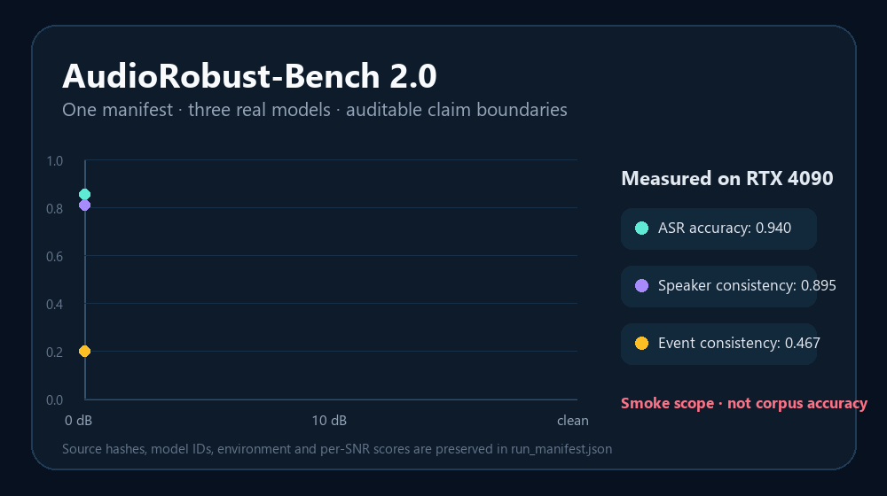
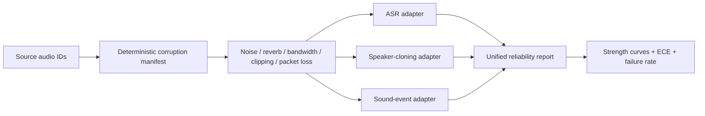

# AudioRobust-Bench 3.0

[](https://github.com/Jatshi/AudioRobust-Bench/releases/tag/v3.0.0)
[](https://github.com/Jatshi/AudioRobust-Bench/actions/workflows/ci.yml)
[](artifacts/smoke/run_manifest.json)
[](artifacts/smoke/run_manifest.json)
[](tests)
[](LICENSE)

[3.0 新增内容](docs/V3_RELEASE_NOTES_ZH.md) · [3.0 学习与踩坑手册](docs/V3_LEARNING_AND_INTERVIEW_ZH.md) · [2.0 升级与学习复盘](docs/V2_UPGRADE_AND_LEARNING_ZH.md) · [measured manifest](artifacts/smoke/run_manifest.json) · [project plan](PROJECT_PLAN.md)



**One corruption manifest, three audio tasks, one reliability report.**

AudioRobust-Bench is a task-agnostic benchmark for measuring how automatic speech
recognition, speaker cloning, and sound-event detection degrade under noise,
reverberation, bandwidth limits, clipping, and packet loss. It replaces three
incomparable demo-specific robustness stories with one deterministic protocol.

> Status: the deterministic CPU contract and a real-model RTX 4090 smoke sweep are
> validated. The published three-SNR result is an engineering smoke test, not a
> corpus-level accuracy claim.

3.0 formalizes the measured 2.0 prototype as a version-aligned, auditable release:
package metadata, runtime version, README, machine-readable evidence, release notes and
the interview-oriented learning guide now share one public contract. It does not claim
new upstream model training. See [what changed](docs/V3_RELEASE_NOTES_ZH.md) and the
[deep learning/pitfall guide](docs/V3_LEARNING_AND_INTERVIEW_ZH.md).

## Verified RTX 4090 smoke

The same hash-verified public JFK sample was evaluated at clean, 10 dB and 0 dB
with Faster-Whisper tiny.en, WavLM speaker verification and AST AudioSet. ASR
character accuracy was 1.000/0.964/0.855; mean speaker consistency was 0.895;
mean event top-5 consistency was 0.467. Source hash, model IDs, transcripts,
labels, environment and exact metric semantics are preserved in
[`artifacts/smoke/run_manifest.json`](artifacts/smoke/run_manifest.json).

## Why it matters

A model can retain a good average score while becoming dangerously overconfident on
hard audio. This benchmark reports both task quality and reliability:

- ASR: normalized character accuracy plus failure and calibration;
- speaker cloning: speaker-embedding similarity plus failure and calibration;
- sound-event detection: label F1 plus failure and calibration;
- every task: corruption-strength slices and expected calibration error (ECE).

## Quick start

```bash
python -m pip install -e .
audio-robust-bench build-manifest \
  --source-id utt-001 --source-id utt-002 \
  --axis snr_db=20,10,0,-5 \
  --axis rt60_s=0,0.3,0.8 \
  --seed 17 \
  --output data/processed/manifest.jsonl

python -m pytest -q
python -m ruff check src tests
```

The manifest IDs and per-case random seeds are stable across runs. `data/raw/` is
immutable; generated audio, predictions, and large artifacts remain outside Git.

## Implemented architecture



## Repository map

```text
src/audio_robust_bench/core.py      manifests, reports, ECE, corruption slices
src/audio_robust_bench/audio.py     deterministic waveform corruptions
src/audio_robust_bench/adapters.py  ASR, cloning, and event metrics
src/audio_robust_bench/cli.py       reproducible manifest CLI
tests/                              dependency-light contract tests
data/                               raw/interim/processed/external layers
experiments/                        future real-model sweep definitions
results/                            generated reports; not fabricated in Git
```

## Source-project relationship

The benchmark will consume outputs from `whisper-scene-asr`,
`robust-speaker-cloning`, and `sound-target-detection-system` through adapters. It
does not rewrite their history or hide negative results. Model and dataset licenses
remain those of the source projects and upstream assets.

## Safety and claim boundary

- The current tests validate contracts and deterministic signal transforms, not model superiority.
- Confidence calibration is task-level reliability evidence, not a guarantee of safe deployment.
- Private audio and embeddings must not be committed; reports should use anonymous source IDs.

## License

Original benchmark code is released under Apache-2.0. Third-party models, public
audio and derived artifacts retain their upstream terms; inspect the run manifest
before redistribution.
